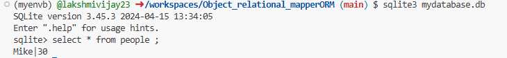

The most common foundational objects for database metadata in SQLAlchemy are known as MetaData, Table, and Column.

In a relational database, tables are the core structures used to store and organize data. Each table contains rows and columns, where each column has a specific data type and each row represents a record.

In SQLAlchemy, the Table object is used to represent a database table in Python. This is part of SQLAlchemy’s Core layer (the lower-level API), and it provides a way to define table structures in code and interact with them directly.

🧱 The Table Object

The Table object defines:

Table name

Column definitions (names, data types, constraints, etc.)

Optional metadata (like primary keys or foreign keys)

It is typically created using the following pattern:

from sqlalchemy import Table, Column, Integer, String, MetaData

metadata = MetaData()

user_table = Table(
    "user",
    metadata,
    Column("id", Integer, primary_key=True),
    Column("name", String),
    Column("age", Integer),
)

Here:

"user" is the name of the table in the database.

metadata holds the schema.

Column() defines each column and its data type.

This object can now be used to generate SQL statements, reflect schemas, and interact with the database.

📌 Why use Table in SQLAlchemy?

It's the foundation for working with raw SQL or SQL Expression Language.

Provides full access to schema-level features (keys, types, constraints).

Can be used with or without the ORM.

❓ Q&A: SQLAlchemy Tables

Q1: What is the purpose of the Table object in SQLAlchemy?
A: It represents a table in a relational database, allowing you to define its structure and interact with it in Python code.

Q2: What arguments does Table() require?
A:

The name of the table as a string

A MetaData object

One or more Column definitions

Q3: What is MetaData() and why is it needed?
A: MetaData() is a container that holds table definitions and schema-related configurations. It helps SQLAlchemy keep track of the database structure.

Q4: Can the Table object be used with the ORM?
A: Not directly — the ORM uses declarative classes to map Python classes to tables, but under the hood, it still relies on the Table object.

Q5: How do you define a primary key in a Table?
A: Use the primary_key=True keyword inside the Column() definition:

Column("id", Integer, primary_key=True)

The Table is constructed programmatically, either directly by using the Table constructor, or indirectly by using ORM Mapped classes (described later at Using ORM Declarative Forms to Define Table Metadata). There is also the option to load some or all table information from an existing database, called reflection.

